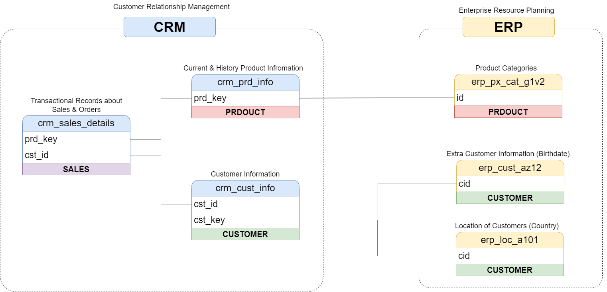
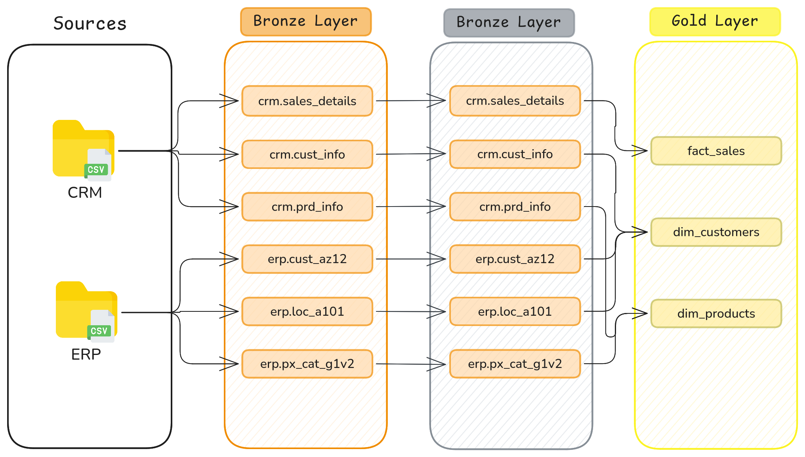
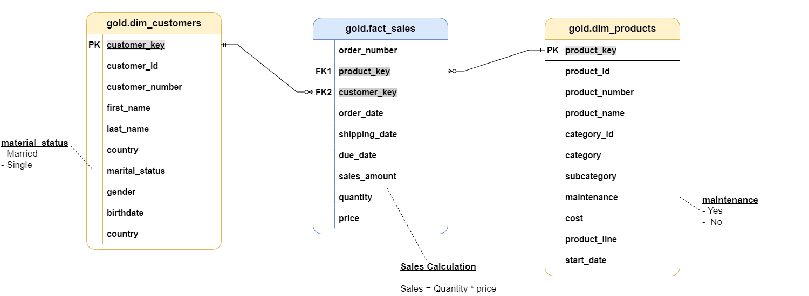

# Documentation Overview

This folder contains all the supporting documentation for the SQL Data Warehouse project — architecture diagrams, data flow visuals, data model diagrams, a data catalog, and naming convention guidelines. Together, these files explain **how the warehouse is designed**, **how data moves through it**, and **how its objects should be named**.

---

## Diagrams

### 1. `data_integration.png` — Data Integration
Illustrates how the different source system tables (from CRM and ERP) relate to and integrate with one another — mapping out which entities connect across systems before they're combined into the warehouse.

### 2. `data_flow.png` — Data Flow
A lineage diagram tracing each table from source system, through Bronze, Silver, and into the Gold-layer objects — showing exactly which raw tables feed into which final dimension/fact tables.

### 3. `data_model.png` — Data Model (Star Schema)
The Gold-layer star schema diagram, showing `fact_sales` at the center connected to `dim_customers` and `dim_products`, including their keys and relationships.

---

## Markdown Documentation

### `data_catalog.md` — Data Catalog for the Gold Layer
Documents every table exposed in the Gold layer, including column names, data types, and descriptions:
- **`gold.dim_customers`** — Customer details enriched with demographic and geographic attributes (name, country, marital status, gender, birthdate, etc.).
- **`gold.dim_products`** — Product attributes such as category, subcategory, cost, product line, and maintenance requirements.
- **`gold.fact_sales`** — Transactional sales data (order number, product/customer keys, order/shipping/due dates, sales amount, quantity, price).

### `naming_conventions.md` — Naming Conventions
Defines the naming standards used across the warehouse:
- **General principles** — `snake_case`, English names, no reserved SQL words.
- **Table naming** — Bronze & Silver tables follow `<sourcesystem>_<entity>` (e.g., `crm_customer_info`); Gold tables follow `<category>_<entity>` (e.g., `dim_customers`, `fact_sales`).
- **Column naming** — Surrogate keys use the `_key` suffix (e.g., `customer_key`); system/technical columns use the `dwh_` prefix (e.g., `dwh_load_date`).
- **Stored procedures** — Follow `load_<layer>` (e.g., `load_bronze`, `load_silver`).

---

## Files in This Folder

| File | Type | Description |
|------|------|-------------|
| `data_arc.png` | Image | Overall data warehouse architecture (Bronze/Silver/Gold) |
| `data_integration.png` | Image | How source system tables integrate with each other |
| `data_flow.png` | Image | End-to-end data lineage from source to Gold layer |
| `data_model.png` | Image | Star schema diagram of the Gold layer |
| `data_catalog.md` | Markdown | Field-level catalog of all Gold layer tables |
| `naming_conventions.md` | Markdown | Naming rules for schemas, tables, columns, and procedures |