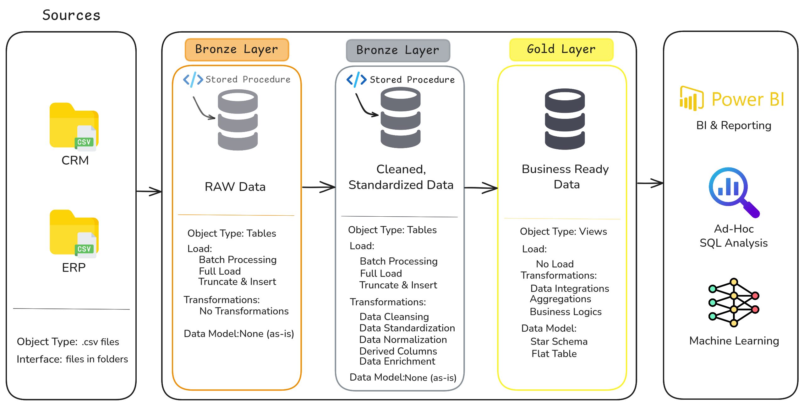

# SQL DWH Project

A modern data warehouse built with **SQL Server**, following the **Medallion Architecture** (Bronze, Silver, Gold layers). This project takes raw ERP and CRM data through a full ETL pipeline — from extraction and cleaning to analytics-ready star schema models — and includes complete documentation, naming conventions, and data quality tests.

---

## Data Architecture



The project follows a **Bronze → Silver → Gold** layered architecture:
- **Bronze Layer** — Raw, unprocessed data ingested as-is from source systems (ERP & CRM), stored in SQL Server tables with no transformations. This preserves an auditable copy of the original data.
- **Silver Layer** — Cleaned, standardized, and conformed data. This layer handles deduplication, data type fixes, null handling, and business rule validation to prepare data for integration.
- **Gold Layer** — Business-ready data modeled into a **star schema** (fact and dimension tables), optimized for reporting, analytics, and BI consumption.

> [!IMPORTANT] 
> For a full breakdown of all architecture diagrams, data flow visuals, the data model, data catalog, and naming conventions, see docs/README.md.

---

## Project Overview

This project simulates a real-world data warehousing workflow, covering:

1. **Data Architecture** — Designing a Bronze, Silver, and Gold layered warehouse.
2. **ETL Pipelines** — Extracting, transforming, and loading data from ERP and CRM source systems using T-SQL.
3. **Data Modeling** — Building fact and dimension tables in a star schema optimized for analytical queries.
4. **Data Quality** — Applying validation checks and tests to ensure consistency and reliability across layers.
5. **Documentation** — Maintaining clear naming conventions, data catalogs, and architecture diagrams for maintainability.

>[!NOTE] 
> Skills demonstrated: SQL Development, Data Architecture, Data Engineering, ETL Pipeline Development, Data Modeling, Data Analytics

>[!NOTE] 
> Tech stack: SQL Server, T-SQL, Excalidraw (for diagrams)

---

## Repository Structure

```
data-warehouse-project/
│
├── datasets/                           # Raw datasets used for the project (ERP and CRM data)
│
├── docs/                               # Project documentation and architecture details
│   ├── etl.excalidraw                  # Diagram of ETL techniques and methods used
│   ├── data_architecture.excalidraw    # Diagram of the overall project architecture
│   ├── data_catalog.md                 # Catalog of datasets, including field descriptions and metadata
│   ├── data_flow.excalidraw            # Data flow diagram across layers
│   ├── data_models.excalidraw          # Data models (star schema) diagram
│   ├── naming-conventions.md           # Naming guidelines for tables, columns, and files
│
├── scripts/                            # SQL scripts for ETL and transformations
│   ├── bronze/                         # Scripts for extracting and loading raw data
│   ├── silver/                         # Scripts for cleaning and transforming data
│   ├── gold/                           # Scripts for building analytical models (star schema)
│
├── tests/                              # Test scripts and data quality checks
│
├── README.md                           # Project overview and instructions
├── .gitignore                          # Files and directories ignored by Git
└── requirements.txt                    # Dependencies and requirements for the project
```